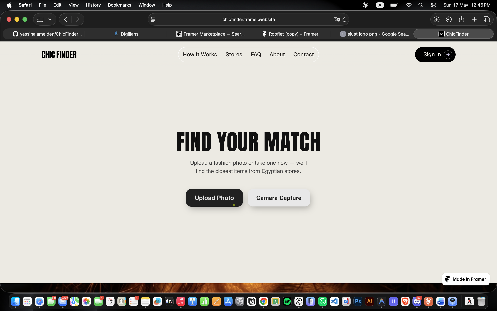
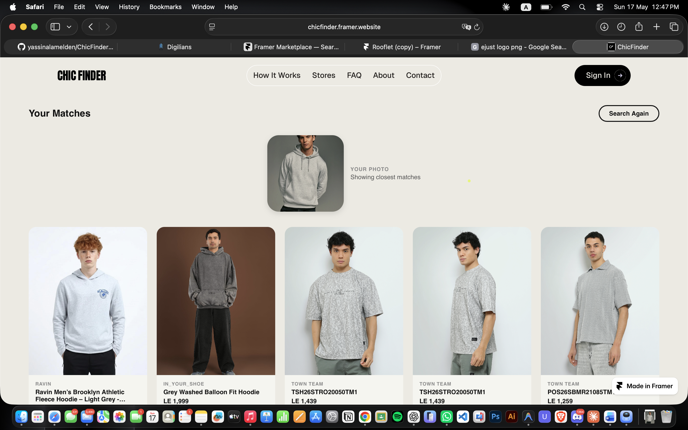

# 👗 ChicFinder: Find Your Style, Shop Local


> **Upload a photo. Find the outfit. Shop Egyptian brands.**

ChicFinder is an AI-powered fashion visual search system built for the Egyptian market. Users upload an outfit photo and receive visually similar, shoppable recommendations from local brands like Tomato, Town Team, LokalEG, and Barawy — powered by FashionCLIP embeddings, Supabase pgvector similarity search, and Gemini 2.5-flash Vision reranking.

---

## 🚀 Features

### 🧠 AI Visual Search

- **FashionCLIP** (`patrickjohncyh/fashion-clip`) — fine-tuned on 8,570 Egyptian fashion product images
- **512-dimensional** L2-normalized embeddings
- **Supabase pgvector** cosine similarity search — Top-20 candidates retrieved per query
- **Deduplication filter** — multiple product angles indexed, only unique products returned

### 👁️ Gemini Vision Intelligence (LLM Layer)

- **OutfitParser** — Gemini 2.5-flash decomposes outfit photo into structured per-item descriptions (type, color, style, gender, material, fit)
- **VisionReranker** — Gemini visually re-scores all Top-20 candidates by actual pixel similarity (temperature=0.0 — deterministic)
- **Centralized prompt engineering** — all prompt templates in `prompt_builder.py`

### 🛍️ Local Brand Catalog

- 8,570+ product images from Egyptian brands: Tomato, Town Team, LokalEG, Barawy
- Rich metadata: brand, price (EGP), product URL, store location, availability

### 🔒 Secure API

- Firebase JWT authentication on all search endpoints
- 10 MB upload guard — rejects oversized images before any processing
- PIL stream verification — detects corrupt images early
- Brand slug caching via `@lru_cache`
- Store catalog pagination

### 📱 Modern Frontend

- Next.js + Tailwind CSS
- Image upload zone with drag-and-drop
- Product card results with brand, price, similarity score
- Firebase Auth — login/onboarding flow

---

## 📸 Screenshots

| Homepage | Search Results |
|---|---|
| *Upload your outfit photo or use camera capture* | *Top-5 matched products from Egyptian brands* |
|  |  |

---

## 🏗️ Architecture

```
User uploads outfit photo (mobile / web)
│
▼
FastAPI /api/v1/search   ← Firebase JWT auth
│
├─── FashionCLIP Encoder ──────► 512-d L2 vector
│
├─── Supabase pgvector ─────────► Top-20 candidates
│         (cosine similarity)
│
├─── Gemini 2.5-flash ──────────► Outfit item list
│    (OutfitParser)              [{type, color, style...}]
│
├─── Gemini 2.5-flash ──────────► Reordered indices
│    (VisionReranker)             [2, 0, 4, 1, 3]
│
▼
Top-5 Results JSON → Next.js Frontend
```

### Tech Stack

**Frontend**

| Technology | Version | Purpose |
|---|---|---|
| Next.js | 16 | React framework, routing |
| Tailwind CSS | 4 | Styling |
| Firebase Auth | latest | User authentication |

**Backend**

| Technology | Version | Purpose |
|---|---|---|
| FastAPI | latest | REST API framework |
| Python | 3.10 | Runtime |
| Supabase | ≥2.0.0 | pgvector database + metadata storage |
| Firebase Admin | ≥6.0.0 | JWT token verification |
| Uvicorn | latest | ASGI server |

**AI & ML**

| Technology | Purpose |
|---|---|
| FashionCLIP (`patrickjohncyh/fashion-clip`) | 512-d fashion-aware image embeddings |
| Supabase pgvector | Cosine similarity vector search |
| Gemini 2.5-flash | Outfit decomposition + visual reranking |
| google-genai SDK | Gemini API client |
| PyTorch (CPU) | FashionCLIP inference |

**Infrastructure**

| Technology | Purpose |
|---|---|
| Railway | Backend deployment |
| Docker | Containerization (CPU-only PyTorch) |
| GitHub Actions | CI/CD |

---

## 🛠️ Installation & Setup

**Prerequisites**

- Python 3.10+
- Node.js 18+
- A Supabase project with pgvector enabled
- A Firebase project
- A Gemini API key (Google AI Studio)

**1. Clone the repository**

```bash
git clone https://github.com/yassinalamelden/ChicFinder.git
cd ChicFinder
```

**2. Environment Variables**

Copy `.env.example` and fill in your keys:

```bash
cp .env.example .env
```

```env
# ChicFinder — environment variables
# Copy to .env and fill in your values

# Supabase (required)
SUPABASE_URL=https://your-project.supabase.co
SUPABASE_SERVICE_ROLE_KEY=your-service-role-key

# Firebase Auth
FIREBASE_PROJECT_ID=your-firebase-project-id

# OpenAI (for future GPT-4o pipeline)
OPENAI_API_KEY=your-openai-key

# CORS — comma-separated frontend URLs
ALLOWED_ORIGINS=http://localhost:3000
```

> **Note:** Also add `GEMINI_API_KEY=your-gemini-key` to your `.env` — required for the OutfitParser and VisionReranker LLM components.

**3. Backend Setup**

```bash
pip install -r requirements.txt
uvicorn api.main:app --reload
# Backend runs on http://localhost:8000
```

**4. Frontend Setup**

```bash
cd FrontEnd
npm install
npm run dev
# Frontend runs on http://localhost:3000
```

---

## 📦 Deployment

**Backend (Railway)**

1. Connect GitHub repo to Railway
2. Set all environment variables from `.env.example` (plus `GEMINI_API_KEY`)
3. Railway auto-detects `Dockerfile.api` — uses CPU-only PyTorch build
4. Dynamic PORT binding handled automatically

**Frontend (Railway / Vercel)**

1. Build command: `npm run build`
2. Output directory: `.next`
3. Set `NEXT_PUBLIC_API_URL` to your Railway backend URL

**Docker (local)**

```bash
docker build -f infrastructure/docker/Dockerfile.api -t chicfinder-api .
docker run -p 8000:8000 --env-file .env chicfinder-api
```

---

## 🔌 API Reference

| Method | Endpoint | Auth | Description |
|---|---|---|---|
| POST | `/api/v1/search` | 🔒 Firebase JWT | Upload base64 image, get Top-5 similar products |
| POST | `/api/v1/recommend` | 🔒 Firebase JWT | Upload multipart image, get recommendations |
| GET | `/api/v1/stores` | Public | List all brand stores |
| GET | `/api/v1/stores/{id}/items` | Public | Paginated store product catalog |
| GET | `/api/v1/health` | Public | Liveness probe — Supabase + encoder status |

```json
// POST /api/v1/search — Request
{
  "image_base64": "..."
}

// Response
{
  "results": [
    {
      "image_id": "tomato_9215097798909_0.jpg",
      "similarity_score": 0.89,
      "brand": "Tomato",
      "price_egp": 149.0,
      "product_url": "https://...",
      "store_location": null,
      "availability_egypt": true
    }
  ],
  "processing_time_ms": 52.9
}
```

---

## 👥 Team — Slice 2

| Member | Role | Module |
|---|---|---|
| Yassin | AI Embeddings | FashionCLIP encoder, Supabase vector store, model training |
| **Moamen** | **LLM Integration & API** | **`ai_engine/llm/`, FastAPI endpoints, Railway deployment** |
| Amr | RAG Pipeline | Offline indexing, data pipeline |
| Gaber | Metadata Injection | Brand/price/URL enrichment (Slice 3) |
| Gendy & Nour | Frontend | Next.js UI, product cards, upload flow |
| Barawy | Data Scraping | Local brand scrapers (LokalEG, Tomato, Town Team) |

---

## 🤝 Contributing

1. Fork the repository
2. Create a feature branch: `git checkout -b feature/your-feature`
3. Commit your changes: `git commit -m 'feat: add your feature'`
4. Push to the branch: `git push origin feature/your-feature`
5. Open a Pull Request

---

## 📄 License

This project is licensed under the [MIT License](LICENSE).
